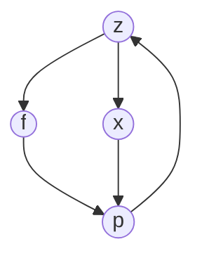

# Probabilidade e Estatística
### Distribuição de Probabilidade
**Professor Petrúcio Barros**

Conteúdos abordados nessa atividade:
```sh
Variáveis Aleatórias
Esperança Matemática
Distribuição Normal 
Distribuição Binomial
Distribuição de Poisson
```


### Como navegar neste repositório


 |File                          |Conteúdo                         |
|-------------------------------|-----------------------------|
|[5d.R](https://github.com/ferreiraluana/distribuicao-de-probabilidade/blob/master/5d.R "5d.R"), [8d.R](https://github.com/ferreiraluana/distribuicao-de-probabilidade/blob/master/8d.R "8d.R"), [9b.R](https://github.com/ferreiraluana/distribuicao-de-probabilidade/blob/master/9b.R "9b.R")|`Código em R referente às questões`         |
|[5d.png](https://github.com/ferreiraluana/distribuicao-de-probabilidade/blob/master/5d.png "5d.png"), [8d.png](https://github.com/ferreiraluana/distribuicao-de-probabilidade/blob/master/8d.png "8d.png"), [9b.png](https://github.com/ferreiraluana/distribuicao-de-probabilidade/blob/master/9b.png "9b.png")          |`Gráficos de distribuição normal gerados em R`            |    
|    [Vari_veis_Aleat_rias_e_Distribui__o_de_Probabilidade.pdf](https://github.com/ferreiraluana/distribuicao-de-probabilidade/blob/master/Vari_veis_Aleat_rias_e_Distribui__o_de_Probabilidade.pdf "Vari_veis_Aleat_rias_e_Distribui__o_de_Probabilidade.pdf")      |`Gráficos referentes aos anexos`|
|[distribuicao.pdf](https://github.com/ferreiraluana/distribuicao-de-probabilidade/blob/master/distribuicao.pdf "distribuicao.pdf")          |`Resoluções das questões propostas na atividade 2`|
|[normal-tables.pdf](https://github.com/ferreiraluana/distribuicao-de-probabilidade/blob/master/normal-tables.pdf "normal-tables.pdf")|`Tabela com os valores de Z e suas correspondentes probabilidades utilizada como referência`|

**A distribuição normal** é a mas importante **distribuição** estatística, considerando a questão prática e teórica. Considerando a probabilidade de ocorrência, a área sob sua curva soma 100%.


Para mais informações:

>https://ocw.mit.edu/courses/electrical-engineering-and-computer-science/6-00-introduction-to-computer-science-and-programming-fall-2008/video-lectures/lecture-22/

